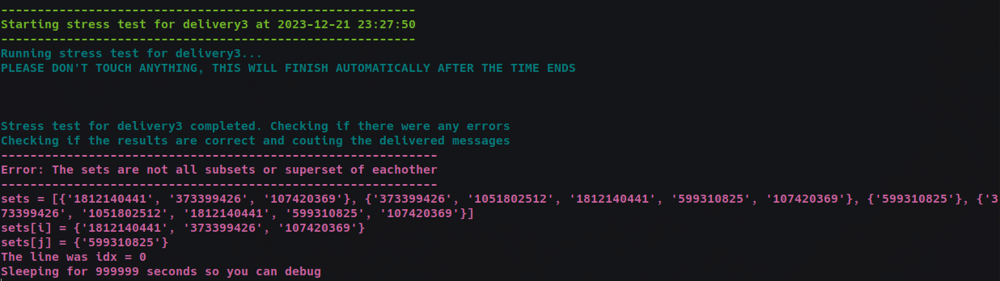
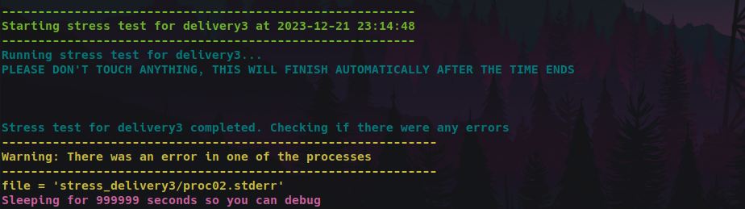

# 2023-EPFL-DA-m3-helperScript
A helper script to test the performance and look for bugs for the 3rd delivery of the DA project.

# Demo





# How to use

This script is a wrapper over `stress.py`, which means that it invokes that script and does some checks and measurements on top of it.  

To run the script:  
1. Move it to the `tools/` directory (where `stress.py` is)
2. Execute it as if you were executing `stress.py`, using the same arguments/flags (`agreement`, `-r`, `-l`, `-p`, `-n`, `-v`, `-d`)
3. Add two extra flags: `-s`/`seconds` and `-t`/`--to_sleep`:
    - `-s`/`seconds`: the number of seconds to timeout after the start of the execution of `stress.py` (so, for instance, you can use a high number of proposals and verify, on average, how many messages are being delivered per minute)
    - `-t`/`--to_sleep`: a `true`/`false` boolean that enables the program to sleep once an error is found (either written on any `.stderr` file or sets that don't follow the validity property). The program will sleep "_forever_", so the files will be avilable on the specified `l` directory to debug.


An example execution is:
```shell
python3 testDelivery3.py agreement -r ../template_cpp/run.sh -l stress_delivery3 -p 4 -n 60000 -v 10 -d 10 -s 10 --to_sleep true
```

## Warning
The `testConfig` is currently defined to not create any SIGTERM signals.  
Please change it in the script file if you intend a different behavior.

## Tip

You can execute it multiple times in a for loop. For instance:
```shell
for i in {1..100000}; do echo $i; python3 testDelivery3.py agreement -r ../template_cpp/run.sh -l stress_delivery3 -p 4 -n 60000 -v 10 -d 10 -s 10 --to_sleep true; done
```
This can help you hunt for very rare bugs that may only happen in very specific situations.